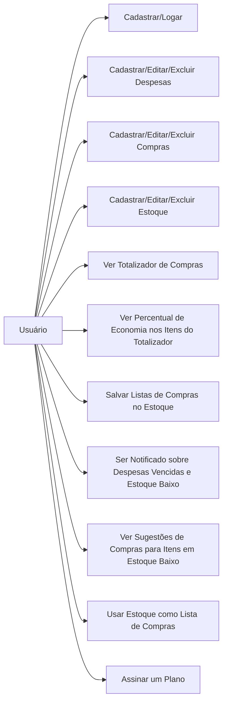
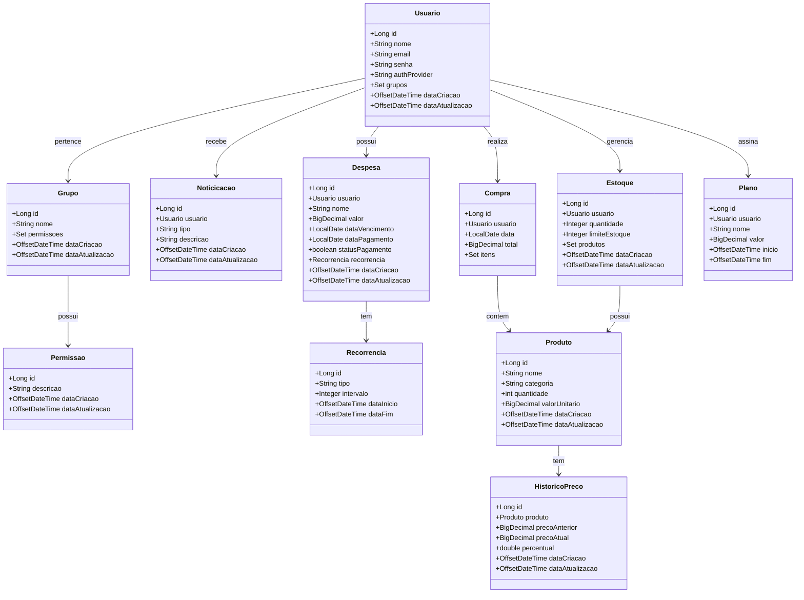
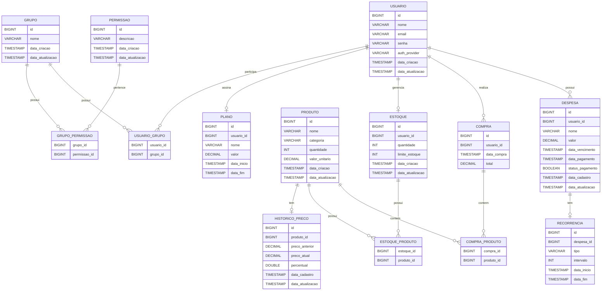
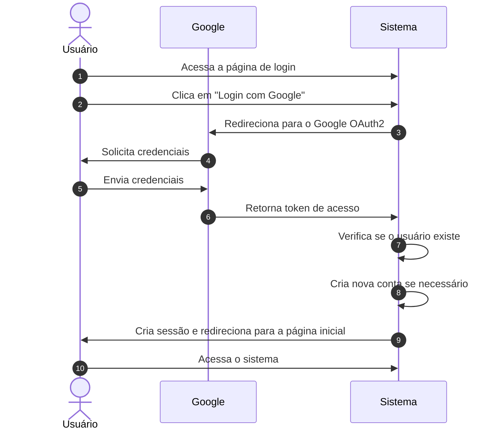
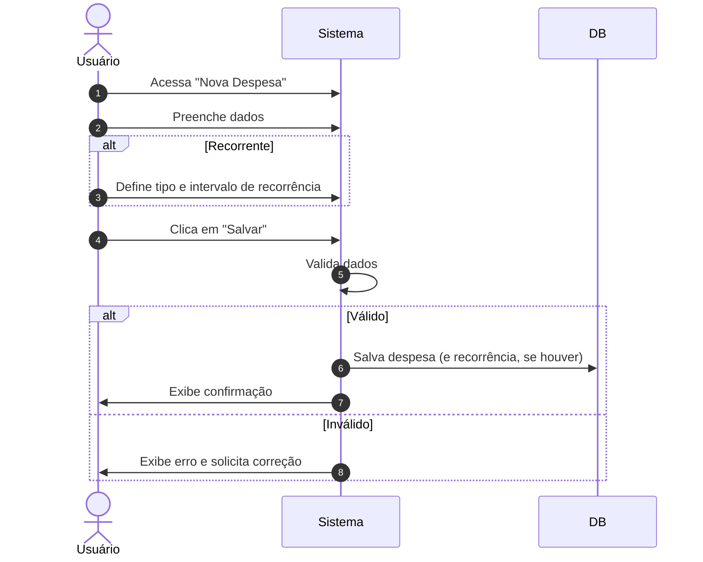
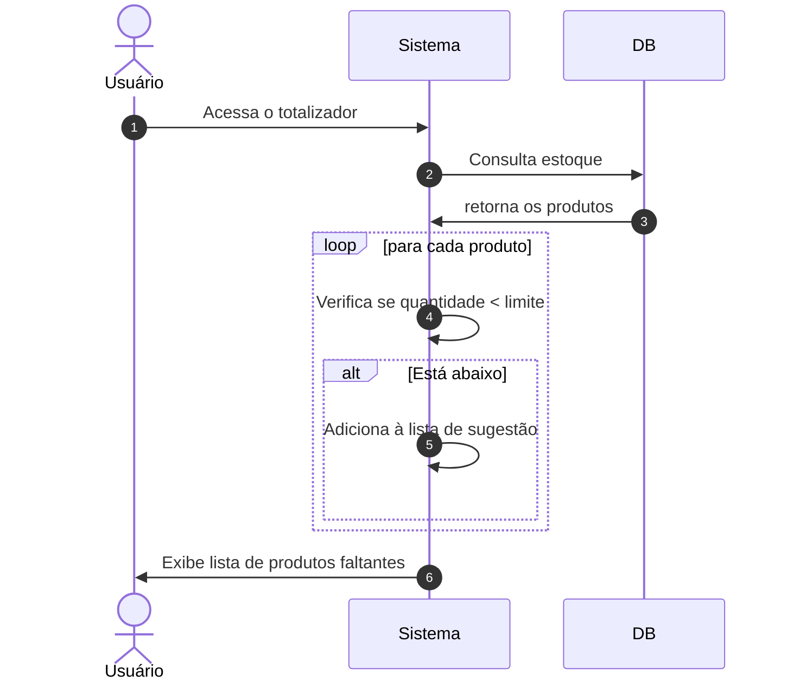
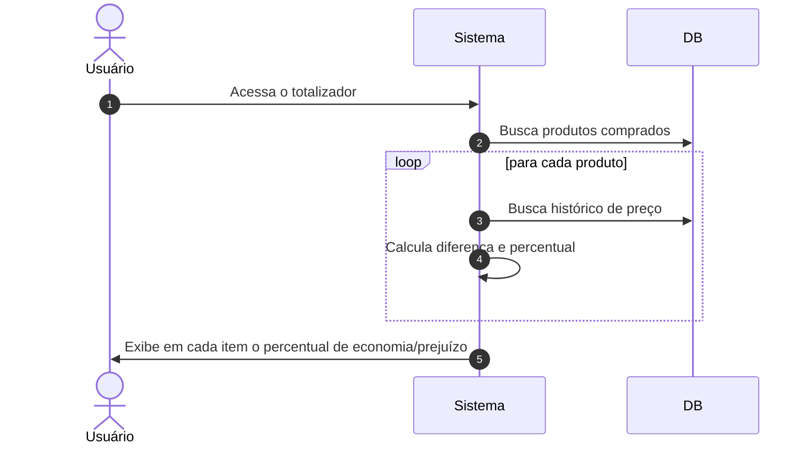
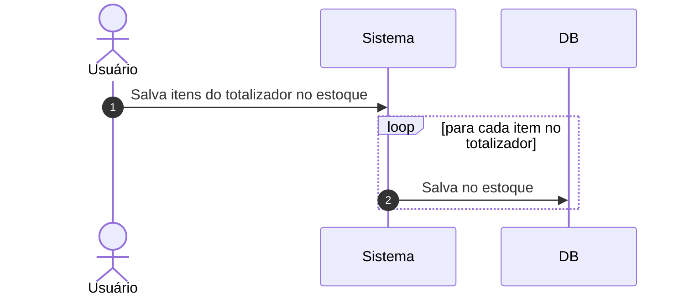

# **Gerenciamento de Despesas e Compras Familiares**

Este sistema foi desenvolvido para facilitar o controle financeiro familiar, proporcionando ao usuário uma visão clara e detalhada sobre seus gastos mensais.

Com ele, é possível cadastrar o salário e gerenciar despesas fixas ou pontuais, editá-las, excluí-las e marcar como pagas. O sistema calcula o saldo restante com base no salário e nas despesas pagas, permitindo melhor planejamento financeiro.

Além disso, o sistema envia notificações para lembrar o usuário sobre contas próximas do vencimento.

Também está disponível um módulo de **lista de compras** com totalizador, que permite cadastrar produtos e estimar o valor a ser pago no caixa. Isso ajuda a evitar cobranças indevidas, comparando os valores registrados com os do sistema do estabelecimento.

O sistema conta com um totalizador de compras mensais, onde o usuário poderá cadastrar itens da sua lista de compras e totalizar o quanto deverá pagar no caixa, evitando pagar a mais por erros de conferência na passagem dos produtos no caixa.  
Assim, o usuário pode conferir o valor do totalizador com o valor do caixa e informar ao atendente caso haja um erro nos valores.
A lista de compras pode ser transformada em um **estoque**, permitindo o controle de produtos disponíveis em casa. O sistema permite definir limites de estoque e envia alertas quando os itens estiverem acabando. Também sugere listas de compras com base no que está em falta.

Com o tempo, o sistema registra o histórico de preços dos produtos e calcula o percentual de economia ou prejuízo mês a mês. Todas essas informações são apresentadas em um dashboard interativo com gráficos.

A lista criada em um momento de compras poderá ser salva como estoque, pois a lista de compras no totalizador será apagada após 24 horas.  
O usuário poderá salvar a lista e editar itens, adicionar, remover e definir um limite de estoque para os itens. Assim, o sistema poderá notificar o usuário quando algum item estiver acabando ou já estiver em falta.  
O usuário também poderá usar o estoque como lista de compras para o mês que desejar. O sistema sugerirá uma lista de compras com itens faltantes no estoque.

Ao longo do uso da lista de compras como estoque e atualização dos valores dos produtos, o sistema exibirá abaixo de cada item um percentual de economia ou prejuízo no mês atual das compras que o usuário realizar.  
O usuário poderá ver um dashboard com todas as suas despesas, percentuais e valores economizados em gráficos.

## **Tecnologias utilizadas:**
- **Backend:** Java, Spring Boot
- **Banco de Dados:** MySQL
- **Frontend:** Thymeleaf
- **Autenticação:** OAuth2 (Login com Google)
- **Versão de controle:** Git
- **Gerenciamento de migrações de banco:** Flyway

## 🛠️ **Funcionalidades**
### 1. **Gestão de Usuários:**
- Cadastro, login, logout.
- Autenticação com Google via OAuth2.
- Assinatura (trial, free, premium)

### 2. **Gestão de Despesas:**
- Cadastro de despesas.
- Edição e exclusão de despesas.
- Filtros: por vencimento, pago/não pago, recorrente.
- Alertas de despesas prestes a vencer.

### 3. **Gestão de Compras:**
- Cadastro de compras.
- Totalizador de lista de compras com valor total e percentual de economia.
- Armazenamento em estoque.

### 4. **Gestão de Estoque:**
- Edição, exclusão e adição de item no estoque.
- Controle de limite de estoque
- Alertas de estoque baixo.

### 5. **Notificações:**
- Notificação para despesas prestes a vencer e estoque baixo.

### 6. **Gráficos:**
- Despesas.
- Economia nas compras.

---

## 📜 **Requisitos**

### Funcionais:
- Cadastro, autenticação e assinatura de usuários.
- CRUD completo para despesas e compras.
- Alerta de vencimento de despesas.
- Totalizador de compras com validade, estoque e percentual de economia.
- Sugestões de compras baseadas no estoque.
- Gráficos de despesas e economia.

### Não Funcionais:
- Sistema responsivo para mobile e desktop.
- OAuth como protocolo de segurança.
- Migrações de banco com Flyway.

---

## 📊 **Diagrama:**

### **Diagrama de Casos de Uso**

### **Diagrama de Classes**


### **Diagrama de ER**



### **Diagrama de Sequência de Autenticação com o Google utilizando OAuth**


### **Diagrama de Sequência de Cadastro de Despesa**


### **Diagrama de Sequência de Sugestão de Itens**


### **Diagrama de Sequência: Exibir Economia ou Prejuízo**


### **Diagrama de Sequência: Armazenamento de compras em estoque**


## 🧑‍💻 **Tecnologias Usadas**

- **Java 17+**
- **Spring Boot**
- **MySQL**
- **Thymeleaf**
- **Flyway**
- **Spring Security (OAuth2)**
- **Docker**

---

## 🔧 **Instalação**

1. Clone o repositório:
    ```bash
    git clone https://github.com/usuario/sistema-gerenciar.git
    ```

2. Navegue até o diretório do projeto:
    ```bash
    cd gerenciar
    ```

3. Compile o projeto com Maven:
    ```bash
    mvn clean install
    ```

4. Execute a aplicação:
    ```bash
    mvn spring-boot:run
    ```

5. Acesse a aplicação no navegador em `http://localhost:8080`.


---
